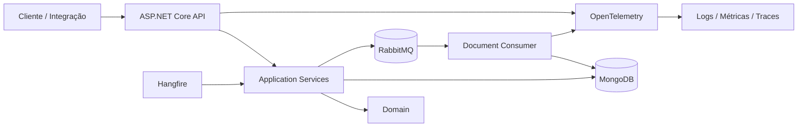

# FiscalFlow

[](https://github.com/Moosy-Joao/Fiscal-Flow/actions/workflows/ci.yml)
[](https://dotnet.microsoft.com/)
[](https://www.mongodb.com/)

API SaaS multi-tenant para recebimento, consulta e processamento assíncrono de documentos fiscais eletrônicos.

O FiscalFlow é um projeto de estudo e portfólio voltado a práticas de backend corporativo com C# e .NET. A solução aplica arquitetura em camadas, persistência NoSQL, isolamento por tenant, idempotência, mensageria, jobs recorrentes, processamento seguro de XML, observabilidade e integração contínua.

> **Status:** em desenvolvimento. A base funcional, o processamento assíncrono e a observabilidade estão implementados. A prioridade atual é concluir autenticação, autorização e demais controles de segurança.

## Funcionalidades implementadas

- criação idempotente de documentos fiscais;
- consulta, listagem paginada e atualização de status;
- isolamento lógico por tenant;
- suporte ao tenant pela claim `tenant_id` em identidades autenticadas;
- fallback pelo cabeçalho `X-Tenant-Id` para requisições anônimas controladas;
- validação e normalização do identificador do tenant;
- persistência no MongoDB com índices compostos;
- publicação e consumo assíncrono pelo RabbitMQ;
- retry e dead-letter queue;
- proteção contra processamento duplicado;
- reprocessamento de falhas com Hangfire;
- detecção de documentos presos em `Processing`;
- upload, leitura segura e extração de dados de XML fiscal;
- logs estruturados, métricas e tracing com OpenTelemetry;
- propagação de correlation ID entre API e consumidor;
- health checks de MongoDB e RabbitMQ;
- respostas de erro padronizadas com `ProblemDetails`;
- testes unitários e de integração;
- pipeline de restore, build, testes e cobertura;
- imagem Docker da API.

## Arquitetura



A solução está dividida em:

```text
FiscalFlow.Api
    ↓
FiscalFlow.Application
    ↓
FiscalFlow.Domain

FiscalFlow.Infrastructure
    ↘ implementa contratos da Application
      e integra MongoDB e RabbitMQ
```

A documentação arquitetural completa está em [`docs/ARCHITECTURE.md`](docs/ARCHITECTURE.md).

## Estrutura do repositório

```text
Fiscal-Flow/
├── src/
│   ├── FiscalFlow.Api/
│   ├── FiscalFlow.Application/
│   ├── FiscalFlow.Domain/
│   └── FiscalFlow.Infrastructure/
├── tests/
│   ├── FiscalFlow.UnitTests/
│   └── FiscalFlow.IntegrationTests/
├── docs/
├── .github/workflows/
├── docker-compose.learning.yml
└── FiscalFlow.slnx
```

## Tecnologias

| Área | Tecnologia | Situação |
|---|---|---|
| API | ASP.NET Core / .NET 10 | Implementado |
| Domínio | C# e regras de negócio isoladas | Implementado |
| Persistência | MongoDB + MongoDB.Driver | Implementado |
| Mensageria | RabbitMQ | Implementado |
| Jobs | Hangfire com storage MongoDB | Parcialmente concluído |
| XML fiscal | APIs seguras de XML do .NET | Implementado |
| Observabilidade | OpenTelemetry | Implementado |
| Documentação da API | OpenAPI | Implementado |
| Testes | xUnit e testes de integração | Implementado |
| CI | GitHub Actions | Implementado |
| Container | Dockerfile da API | Implementado |
| Autenticação | JWT Bearer | Próxima etapa |
| Autorização | Políticas e tenant autenticado | Próxima etapa |
| Rate limiting | ASP.NET Core Rate Limiting | Próxima etapa |

## Multi-tenancy

Os endpoints fiscais precisam de um tenant válido. No estado atual:

- identidades autenticadas usam a claim `tenant_id`;
- requisições anônimas controladas usam `X-Tenant-Id`;
- uma identidade autenticada sem tenant recebe `403 Forbidden`;
- uma requisição anônima sem cabeçalho recebe `400 Bad Request`;
- acessos cruzados retornam `404 Not Found`, evitando revelar dados de outro tenant.

Exemplo de cabeçalho para o modo sem autenticação:

```http
X-Tenant-Id: empresa-a
```

## Idempotência

A criação utiliza a combinação:

```text
tenantId + externalDocumentId
```

Comportamento:

- primeira requisição: `201 Created` e `wasCreated: true`;
- repetição: `200 OK` e `wasCreated: false`;
- ambas retornam o mesmo documento;
- o índice único do MongoDB protege cenários concorrentes.

## Processamento assíncrono

```text
API
→ persiste como Received
→ publica mensagem no RabbitMQ
→ consumidor captura atomicamente
→ processa o XML
→ atualiza para Processed ou Failed
```

Mensagens repetidas não causam processamento duplicado. Falhas temporárias passam por retry e falhas irrecuperáveis seguem para a dead-letter queue.

## Endpoints principais

| Método | Rota | Descrição |
|---|---|---|
| `GET` | `/api/health` | Estado básico da aplicação |
| `GET` | `/health/live` | Liveness probe |
| `GET` | `/health/ready` | Readiness de dependências |
| `POST` | `/api/fiscal-documents` | Cria ou retorna um documento existente |
| `GET` | `/api/fiscal-documents` | Lista documentos do tenant |
| `GET` | `/api/fiscal-documents/{id}` | Consulta um documento por ID |
| `PATCH` | `/api/fiscal-documents/{id}/status` | Atualiza o status |

Exemplos completos estão em [`docs/API.md`](docs/API.md) e [`docs/ENDPOINTS.md`](docs/ENDPOINTS.md).

## Executar localmente

### Pré-requisitos

- .NET SDK 10;
- Docker Desktop ou Docker Engine;
- Git.

### Restaurar, compilar e testar

```bash
git clone https://github.com/Moosy-Joao/Fiscal-Flow.git
cd Fiscal-Flow
dotnet restore FiscalFlow.slnx
dotnet build FiscalFlow.slnx
dotnet test FiscalFlow.slnx
```

### Subir dependências locais

```bash
docker compose -f docker-compose.learning.yml up -d
```

### Iniciar a API

```bash
dotnet run --project src/FiscalFlow.Api/FiscalFlow.Api.csproj --launch-profile http
```

A configuração por ambiente está documentada em [`docs/CONFIGURATION.md`](docs/CONFIGURATION.md).

## Fluxo de desenvolvimento

O projeto utiliza somente três branches permanentes:

```text
main  → versão validada
  ↑
tests → validação integrada e CI
  ↑
dev   → novas implementações e correções
```

Processo obrigatório:

1. implementar na `dev`;
2. sincronizar `tests` com a `dev`;
3. executar restore, build e testes na `tests`;
4. corrigir falhas na `dev` e repetir a validação;
5. promover `tests` para `main` somente quando tudo estiver aprovado;
6. sincronizar novamente `dev` e `tests` com a `main`.

Nenhuma branch adicional é necessária para o fluxo atual.

## Integração contínua

O GitHub Actions executa:

```text
restore → build Release → test → cobertura
```

A branch `tests` é o ambiente de validação antes da promoção para `main`. A `main` também é validada após cada atualização.

## Próximas etapas

1. autenticação JWT;
2. autorização e políticas de acesso;
3. rate limiting;
4. configuração segura de segredos;
5. rotina de limpeza e proteção do dashboard Hangfire;
6. Docker Compose completo;
7. testes ponta a ponta;
8. deploy e demonstração para portfólio.

O detalhamento está em [`docs/ROADMAP.md`](docs/ROADMAP.md).

## Documentação

- [Arquitetura](docs/ARCHITECTURE.md)
- [Referência da API](docs/API.md)
- [Catálogo de endpoints](docs/ENDPOINTS.md)
- [Configuração por ambiente](docs/CONFIGURATION.md)
- [Respostas de erro](docs/ERROR_RESPONSES.md)
- [Roadmap](docs/ROADMAP.md)
- [Descrições para portfólio](docs/PROJECT-DESCRIPTIONS.md)

## Autor

Desenvolvido por **João Pedro Pereira Marques** como projeto de estudo e portfólio em Engenharia de Software e desenvolvimento backend com C#/.NET.
