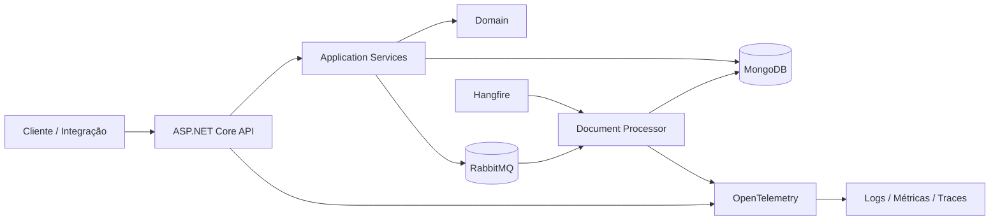

# FiscalFlow

[](https://github.com/Moosy-Joao/Fiscal-Flow/actions/workflows/ci.yml)
[](https://dotnet.microsoft.com/)
[](https://www.mongodb.com/)
[](#)

API SaaS multi-tenant para recebimento, consulta e processamento de documentos fiscais eletrônicos.

O projeto foi criado como laboratório prático de backend corporativo com C# e .NET, cobrindo arquitetura em camadas, persistência NoSQL, isolamento por tenant, idempotência, concorrência, processamento assíncrono, observabilidade e automação de entrega.

> **Status:** em desenvolvimento. A base de API, MongoDB, multi-tenancy e idempotência já está implementada. RabbitMQ, Hangfire, importação de XML, autenticação e observabilidade fazem parte da arquitetura final planejada.

## Objetivo

O FiscalFlow simula uma plataforma capaz de receber documentos fiscais de diferentes empresas, garantir que cada tenant acesse apenas os próprios dados e processar cada documento de forma confiável, rastreável e resiliente.

O projeto busca demonstrar:

- domínio independente de infraestrutura;
- separação de responsabilidades entre API, aplicação, domínio e persistência;
- persistência com MongoDB;
- isolamento lógico de dados por tenant;
- criação idempotente e proteção contra concorrência;
- paginação, filtros e índices compostos;
- testes unitários e de integração;
- integração contínua com GitHub Actions;
- evolução planejada para mensageria, tarefas agendadas, XML fiscal e observabilidade.

## Funcionalidades implementadas

- criação de documentos fiscais;
- retorno idempotente para requisições repetidas;
- consulta por identificador interno;
- listagem paginada;
- filtro por status;
- atualização controlada do status de processamento;
- isolamento por tenant através do cabeçalho `X-Tenant-Id`;
- índice único por `tenantId + externalDocumentId`;
- índices de apoio para listagem e filtro;
- health endpoint;
- documentação OpenAPI em ambiente de desenvolvimento;
- testes unitários e de integração;
- pipeline de restore, build, testes e cobertura.

## Arquitetura

A solução segue uma separação em camadas:

```text
FiscalFlow.Api
    ↓
FiscalFlow.Application
    ↓
FiscalFlow.Domain

FiscalFlow.Infrastructure
    ↘ implementa contratos da Application
      e persiste dados no MongoDB
```

### Arquitetura final planejada



A documentação arquitetural completa está em [`docs/ARCHITECTURE.md`](docs/ARCHITECTURE.md).

## Estrutura do repositório

```text
Fiscal-Flow/
├── src/
│   ├── FiscalFlow.Api/
│   ├── FiscalFlow.Application/
│   ├── FiscalFlow.Domain/
│   └── FiscalFlow.Infrastructure/
├── tests/
│   ├── FiscalFlow.UnitTests/
│   └── FiscalFlow.IntegrationTests/
├── docs/
├── .github/workflows/
├── docker-compose.learning.yml
└── FiscalFlow.slnx
```

## Tecnologias

| Área | Tecnologia | Situação |
|---|---|---|
| API | ASP.NET Core / .NET 10 | Implementado |
| Domínio | C# com regras de negócio isoladas | Implementado |
| Persistência | MongoDB 8 + MongoDB.Driver | Implementado |
| Documentação da API | OpenAPI | Implementado |
| Testes | xUnit + testes de integração | Implementado |
| CI | GitHub Actions | Implementado |
| Containers locais | Docker Compose | Implementado para MongoDB |
| Mensageria | RabbitMQ | Planejado |
| Jobs | Hangfire | Planejado |
| XML fiscal | System.Xml / validação segura | Planejado |
| Observabilidade | OpenTelemetry | Planejado |
| Autenticação | JWT e autorização por tenant | Planejado |

## Modelo de documento

Um documento fiscal possui os seguintes dados principais:

| Campo | Descrição |
|---|---|
| `id` | Identificador interno em formato GUID |
| `tenantId` | Empresa proprietária do documento |
| `externalDocumentId` | Identificador fornecido pelo sistema de origem |
| `status` | Estado atual do processamento |
| `receivedAtUtc` | Momento de recebimento |
| `processedAtUtc` | Momento de conclusão, quando aplicável |
| `failureReason` | Motivo da falha, quando aplicável |

## Estados de processamento

```text
Received → Processing → Processed
    ↑           ↓
    └──────── Failed
```

Estados disponíveis:

- `Received`;
- `Processing`;
- `Processed`;
- `Failed`.

Regras importantes:

- um documento processado não pode voltar a estados anteriores;
- um documento precisa estar em processamento antes de ser concluído;
- documentos com falha precisam informar o motivo;
- documentos com falha podem ser reprocessados.

## Multi-tenancy

Os endpoints de documentos exigem:

```http
X-Tenant-Id: empresa-a
```

O tenant não é aceito no corpo ou na query string. Ele é obtido pelo middleware e aplicado em todas as operações de criação, consulta, listagem e atualização.

O projeto retorna `404 Not Found` quando um tenant tenta acessar um documento pertencente a outro tenant, evitando revelar a existência do registro.

## Idempotência

A criação utiliza a combinação:

```text
tenantId + externalDocumentId
```

Comportamento:

- primeira requisição: `201 Created` e `wasCreated: true`;
- repetição da mesma requisição: `200 OK` e `wasCreated: false`;
- ambas retornam o mesmo documento;
- o índice único do MongoDB impede duplicidade em cenários concorrentes.

## Endpoints

Base local:

```text
http://localhost:5298
```

| Método | Rota | Descrição |
|---|---|---|
| `GET` | `/api/health` | Verifica a disponibilidade da aplicação |
| `POST` | `/api/fiscal-documents` | Cria ou retorna um documento existente |
| `GET` | `/api/fiscal-documents` | Lista documentos do tenant |
| `GET` | `/api/fiscal-documents/{id}` | Consulta um documento por ID |
| `PATCH` | `/api/fiscal-documents/{id}/status` | Atualiza o status |

Exemplos completos estão em [`docs/API.md`](docs/API.md).

## Executar localmente

### Pré-requisitos

- .NET SDK 10;
- Docker Desktop ou Docker Engine;
- Git.

### 1. Clonar e restaurar

```bash
git clone https://github.com/Moosy-Joao/Fiscal-Flow.git
cd Fiscal-Flow
dotnet restore FiscalFlow.slnx
```

### 2. Iniciar o MongoDB

```bash
docker compose -f docker-compose.learning.yml up -d
```

### 3. Compilar e testar

```bash
dotnet build FiscalFlow.slnx
dotnet test FiscalFlow.slnx
```

### 4. Iniciar a API

```bash
dotnet run --project src/FiscalFlow.Api/FiscalFlow.Api.csproj --launch-profile http
```

### 5. Verificar a saúde

```bash
curl http://localhost:5298/api/health
```

Resposta esperada:

```json
{
  "application": "FiscalFlow",
  "status": "Healthy",
  "checkedAtUtc": "2026-06-20T00:00:00+00:00"
}
```

## Configuração

Configuração de desenvolvimento:

```json
{
  "MongoDb": {
    "ConnectionString": "mongodb://localhost:27017",
    "DatabaseName": "fiscalflow",
    "InitializeIndexes": true
  }
}
```

Em ambientes reais, credenciais e endereços devem ser fornecidos por variáveis de ambiente ou secret stores.

## Testes e integração contínua

A solução contém:

- testes unitários das regras e serviços de aplicação;
- testes de integração da API;
- fake repository para testes isolados;
- validações de multi-tenancy e idempotência;
- workflow do GitHub Actions executado em pushes e Pull Requests para `main`.

O pipeline executa:

```text
restore → build Release → test → coleta de cobertura
```

## Roadmap

- [x] Fundação e arquitetura em camadas
- [x] Health endpoint e OpenAPI
- [x] MongoDB e índices
- [x] Criação, consulta, atualização e listagem
- [x] Filtros e paginação
- [x] Multi-tenancy
- [x] Idempotência e concorrência
- [ ] RabbitMQ e consumidor assíncrono
- [ ] Retry e dead-letter queue
- [ ] Hangfire e reprocessamento agendado
- [ ] Upload, validação e leitura de XML fiscal
- [ ] Logs estruturados, métricas e tracing
- [ ] JWT, autorização e rate limiting
- [ ] Docker Compose completo
- [ ] Deploy e testes de fluxo completo

O detalhamento está em [`docs/ROADMAP.md`](docs/ROADMAP.md).

## Documentação

- [Arquitetura](docs/ARCHITECTURE.md)
- [Referência da API](docs/API.md)
- [Roadmap e definição de concluído](docs/ROADMAP.md)
- [Descrições para portfólio, currículo e LinkedIn](docs/PROJECT-DESCRIPTIONS.md)

## Aprendizados demonstrados

- modelagem de domínio;
- aplicação prática de separação em camadas;
- injeção de dependência;
- persistência e índices com MongoDB;
- tratamento de concorrência;
- idempotência em APIs;
- isolamento multi-tenant;
- testes automatizados;
- versionamento com Git e Pull Requests;
- integração contínua.

## Autor

Desenvolvido por **João Pedro Pereira Marques** como projeto de estudo e portfólio em Engenharia de Software e desenvolvimento backend com C#/.NET.
