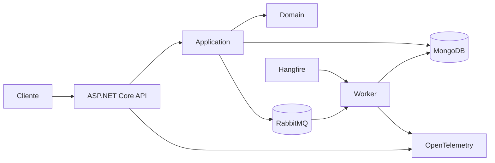

# Arquitetura do FiscalFlow

## Visão geral

O FiscalFlow é uma API SaaS multi-tenant para recebimento e processamento de documentos fiscais. A solução separa entrada HTTP, casos de uso, regras de domínio e infraestrutura.

## Camadas

### FiscalFlow.Api

Responsável por controllers, contratos HTTP, middleware de tenant, health endpoint e OpenAPI.

### FiscalFlow.Application

Coordena os casos de uso e depende de contratos de persistência.

### FiscalFlow.Domain

Contém a entidade `FiscalDocument`, seus estados e regras de transição. Não depende de banco de dados nem de ASP.NET Core.

### FiscalFlow.Infrastructure

Implementa persistência, mapeamento e índices do MongoDB.

## Dependências

```text
Api → Application
Api → Infrastructure
Application → Domain
Infrastructure → Application
Infrastructure → Domain
Domain → nenhuma camada externa
```

## Fluxo atual de criação

```text
Cliente
  → API valida X-Tenant-Id
  → Application procura tenantId + externalDocumentId
  → documento existente: 200 OK
  → documento novo: MongoDB e 201 Created
```

A idempotência usa a combinação `tenantId + externalDocumentId`. A aplicação consulta antes de inserir e o índice único do MongoDB protege contra requisições concorrentes.

## Multi-tenancy

O middleware lê `X-Tenant-Id` e preenche o contexto da requisição. Todas as consultas, atualizações e listagens aplicam o tenant como filtro obrigatório.

Consultas por documento usam:

```text
id + tenantId
```

Um tenant não recebe informação sobre documentos de outro tenant.

## Modelo de domínio

```text
FiscalDocument
├── Id
├── TenantId
├── ExternalDocumentId
├── Status
├── ReceivedAtUtc
├── ProcessedAtUtc
└── FailureReason
```

Estados:

```text
Received → Processing → Processed
Received → Failed
Processing → Failed
Failed → Processing
```

## Índices do MongoDB

```text
{ tenantId: 1, externalDocumentId: 1 } unique
{ tenantId: 1, receivedAtUtc: -1 }
{ tenantId: 1, status: 1, receivedAtUtc: -1 }
```

Eles garantem unicidade e aceleram listagem e filtro por status.

## Arquitetura final planejada



Fluxo final esperado:

```text
POST
  → documento salvo como Received
  → mensagem publicada
  → consumidor marca Processing
  → processamento de XML
  → Processed ou Failed
  → reprocessamento agendado quando necessário
```

## Componentes futuros

- RabbitMQ para desacoplar recebimento e processamento;
- consumidor assíncrono e idempotente;
- retry limitado e dead-letter queue;
- Hangfire para reprocessamentos;
- leitura segura de XML fiscal;
- autenticação e autorização;
- logs estruturados, métricas e tracing;
- Docker Compose completo e deploy.

## Requisitos não funcionais

- isolamento entre tenants;
- consistência sob concorrência;
- baixo acoplamento;
- rastreabilidade;
- testes automatizados;
- configuração por ambiente;
- recuperação de falhas.
