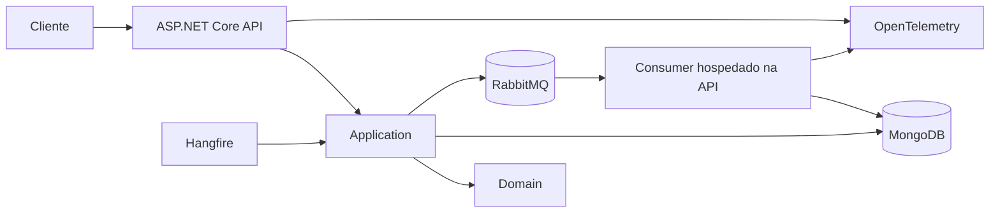

# Arquitetura do FiscalFlow

## Visão geral

O FiscalFlow é uma API SaaS multi-tenant para recebimento e processamento de documentos fiscais eletrônicos. A solução separa entrada HTTP, casos de uso, regras de domínio e infraestrutura, com processamento assíncrono via RabbitMQ e rotinas recorrentes via Hangfire.

## Camadas

### FiscalFlow.Api

Responsável por controllers, contratos HTTP, middleware de tenant e correlation ID, health checks, OpenAPI, autenticação JWT, rate limiting, consumidor RabbitMQ hospedado e jobs Hangfire.

### FiscalFlow.Application

Coordena os casos de uso: criação idempotente, listagem, consulta, atualização de status, processamento de XML, reprocessamento em lote e detecção de timeout. Depende de contratos de persistência e mensageria, sem referência direta a MongoDB ou RabbitMQ.

### FiscalFlow.Domain

Contém a entidade `FiscalDocument`, estados, transições e `FiscalDocumentData`. Não depende de banco de dados nem de ASP.NET Core.

### FiscalFlow.Infrastructure

Implementa persistência MongoDB (repository, mapeamento, índices), publicação RabbitMQ e inicialização de topologia de filas.

## Dependências

```text
Api → Application
Api → Infrastructure
Application → Domain
Infrastructure → Application
Infrastructure → Domain
Domain → nenhuma camada externa
```

## Fluxo de criação

```text
Cliente
  → API valida tenant (claim ou X-Tenant-Id)
  → Application procura tenantId + externalDocumentId
  → documento existente: 200 OK (republica mensagem se ainda Received)
  → documento novo: persiste como Received, publica no RabbitMQ e 201 Created
```

A idempotência usa a combinação `tenantId + externalDocumentId`. A aplicação consulta antes de inserir e o índice único do MongoDB protege contra requisições concorrentes.

## Processamento assíncrono

```text
RabbitMQ
  → consumidor recebe mensagem
  → TryStartProcessingAsync (captura atômica)
  → ProcessFiscalDocumentService parseia XML
  → CompleteProcessing ou MarkAsFailed
  → persistência atualizada
```

Mensagens duplicadas são ignoradas quando o documento já saiu de `Received`. Falhas temporárias passam por fila de retry; após esgotar tentativas, vão para dead-letter queue.

## Jobs Hangfire

Dois jobs recorrentes rodam quando `BackgroundJobs:Enabled` é verdadeiro:

| Job | Responsabilidade |
|---|---|
| `retry-failed-documents` | Reprocessa documentos em `Failed` dentro do limite de tentativas |
| `detect-timed-out-processing` | Marca como `Failed` documentos presos em `Processing` além do timeout |

Detalhes em [`HANGFIRE_TIMEOUT.md`](HANGFIRE_TIMEOUT.md).

## Multi-tenancy

O `TenantMiddleware` resolve o tenant antes dos endpoints fiscais:

- identidade autenticada: claim `tenant_id`;
- requisição anônima: cabeçalho `X-Tenant-Id`;
- identidade autenticada sem tenant: `403 Forbidden`;
- requisição anônima sem cabeçalho: `400 Bad Request`.

Todas as consultas, atualizações e listagens aplicam o tenant como filtro obrigatório. Consultas por documento usam `id + tenantId`. Um tenant não recebe informação sobre documentos de outro tenant (`404 Not Found`).

## Segurança

Quando `Security:Enabled` é verdadeiro:

- endpoints fiscais exigem JWT Bearer com claims `sub` e `tenant_id`;
- endpoints de saúde permanecem anônimos;
- rate limiting aplica janela fixa por `sub`, IP ou chave anônima.

Quando desabilitada (padrão local), apenas o tenant via cabeçalho é exigido. Detalhes em [`SECURITY.md`](SECURITY.md).

## Modelo de domínio

```text
FiscalDocument
├── Id
├── TenantId
├── ExternalDocumentId
├── XmlContent
├── FiscalData
│   ├── AccessKey
│   ├── IssuerDocument / IssuerName
│   ├── RecipientDocument / RecipientName
│   ├── TotalValue
│   └── IssuedAt
├── Status
├── ReceivedAtUtc
├── ProcessedAtUtc
├── FailureReason
├── ReprocessingAttempts
└── LastReprocessingAtUtc
```

Estados e transições:

```text
Received → Processing → Processed
Received → Failed
Processing → Failed
Failed → Processing (via reprocessamento)
```

`Processed` é terminal.

## Índices do MongoDB

```text
{ tenantId: 1, externalDocumentId: 1 } unique
{ tenantId: 1, receivedAtUtc: -1 }
{ tenantId: 1, status: 1, receivedAtUtc: -1 }
```

Eles garantem unicidade e aceleram listagem e filtro por status.

## Observabilidade

- logs estruturados com correlation ID e tenant;
- métricas customizadas (`FiscalFlow.Documents`);
- tracing OpenTelemetry com propagação W3C e headers AMQP;
- health checks `/health/live` e `/health/ready`.

Detalhes em [`OBSERVABILITY.md`](OBSERVABILITY.md).

## Diagrama de implantação



## Requisitos não funcionais

- isolamento entre tenants;
- consistência sob concorrência;
- baixo acoplamento entre camadas;
- rastreabilidade com correlation ID e tracing;
- testes automatizados (unitários e integração);
- configuração por ambiente;
- recuperação de falhas via retry, DLQ e jobs recorrentes.
